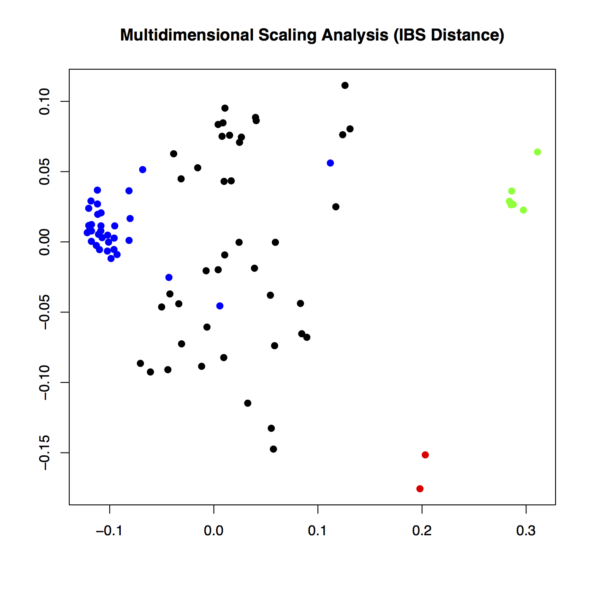
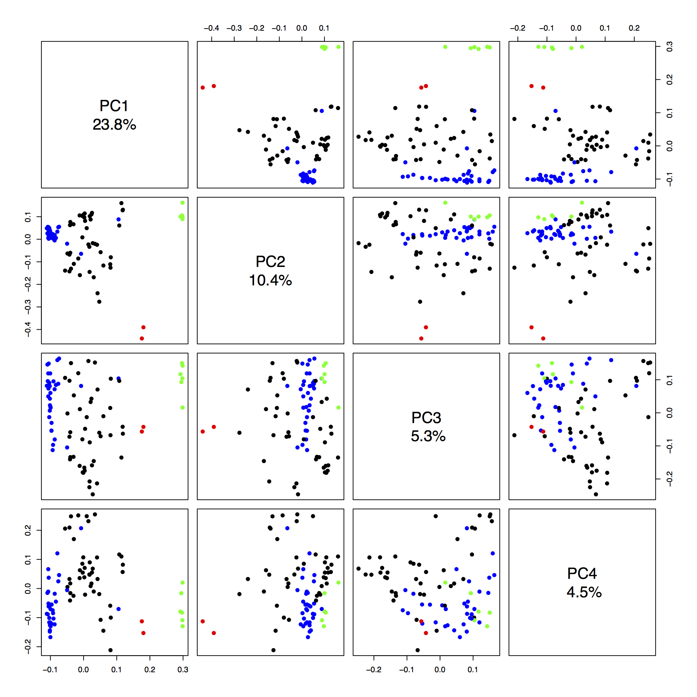

# Processing and analyzing the Mexican Wolf genotype data.
1. Initially, all data was loaded into GENOMESTUDIO (see [here](https://www.illumina.com/techniques/microarrays/array-data-analysis-experimental-design/genomestudio.html))
2. Clustering was performed using the canine.egt file
3. We removed any SNP with a GenTrain Score of <0.35
    - More stringent than the recommended 0.15 by Illumina for Infinium
4. Exported the more or less raw data to PLINK format
    - MW.ped and MW.map
    - 172114 out of the 173662 SNPs remained
5. Saved "Reproducibility and Heritability" report
    - this analysed the errors among replicates and Mendelian inheritance errors among parent-child relationships.
    - [view the report here](./Data/MW-5-9-2014-Reproducibility_and_Heritability_Report.csv)
6. Converted to binary format using [PLINK v1.07](http://zzz.bwh.harvard.edu/plink/)
```bash
plink \
   --noweb \
   --nonfounders \
   --dog \
   --file MW \
   --make-bed \
   --out MW
```
7.  Modified the .fam file with the updated sample identifications
8.  Calculated Missingness statistics (genotyping rates by locus and individual
```bash
plink \
   --noweb \
   --nonfounders \
   --dog \
   --bfile MW \
   --missing \
   --out MW
	# Results:
	# MW.imiss - missingness statistics by individual
	# MW.lmiss - missingness statistics by loci
```
9.  Made a file `remove.list` containing the IDs of the 8 individuals to remove
    - 8 duplicates (the replicate with the lowest call rate for each pair was removed)
10. Made a cleaned file:
    - by removing the 8 individuals above
    - SNPs with a minimum allele frequency <0.05
    - SNPs with a genotyping rate <90%
    - Individuals with a genotyping rate <90%
    - Hardy-Weinberg Equilibrium p<0.001
    - Removed X and Y SNPs (XY\_exclude.list)
```bash
# Get list of X and Y SNPs
grep \
   -e "^39" \
   -e "^40" MW.bim | \
   cut -f2 > XY_exclude.list

# Process in PLINK
plink \
   --noweb \
   --nonfounders \
   --dog \
   --bfile MW \
   --remove remove.list \
   --exclude XY_exclude.list \
   --mind 0.1 \
   --maf 0.05 \
   --geno 0.1 \
   --hwe 0.001 \
   --make-bed \
   --out MW.clean
   # Results
	# 172114 markers to be included from [MW.bim ]
	# Reading pedigree information from [ MW.fam ] 
	# 96 individuals read from [ MW.fam ] 
	# 50 individuals with nonmissing phenotypes
	# Assuming a quantitative trait
	# Missing phenotype value is -9
	# 50 males, 46 females, and 0 of unspecified sex
	# Reading genotype bitfile from [ MW.bed ] 
	# Detected that binary PED file is v1.00 SNP-major mode
	# Reading list of SNPs to exclude [ XY_exclude.list ] ... 5532 read
	# Reading individuals to remove [ remove.list ] ... 8 read
	# 8 individuals removed with --remove option
	# Before frequency and genotyping pruning, there are 166582 SNPs
	# 29 founders and 59 non-founders found
	# Writing list of removed individuals to [ MW.clean.irem ]
	# 4 of 88 individuals removed for low genotyping ( MIND > 0.1 )
	# 1036 markers to be excluded based on HWE test ( p <= 0.001 )
	# Total genotyping rate in remaining individuals is 0.988855
	# 3432 SNPs failed missingness test ( GENO > 0.1 )
	# 101742 SNPs failed frequency test ( MAF < 0.05 )
	# After frequency and genotyping pruning, there are 62219 SNPs
	# After filtering, 48 individuals with non-missing status
	# After filtering, 43 males, 41 females, and 0 of unspecified sex
	# Writing pedigree information to [ MW.clean.fam ] 
	# Writing map (extended format) information to [ MW.clean.bim ] 
	# Writing genotype bitfile to [ MW.clean.bed ] 
	# Using (default) SNP-major mode
```

This cleaned dataset is used for the downstream analyses, and contains 62219 SNPs and 84 individuals (83 Mexican wolves + 1 dog genotyping control)

## LD Pruning the dataset
We next removed SNPs in high linkage disequilibrium (LD).  We used a window size of 1 MB (megabase), and randomly removed 1 SNP from each pair if the r > 0.5.  We did this using the software package [SNPRelate v0.9.18](http://bioconductor.org/packages/release/bioc/html/SNPRelate.html) in R.  The file containing the pedigree data and other sample info for each Mexican wolf is [MW-pedigree-data.csv](./Data/MW-pedigree-data.csv).

```R
# Install and setup package
source("https://bioconductor.org/biocLite.R")
biocLite("SNPRelate")
library(SNPRelate)

# Set names to input Plink-formatted files and convert to gds file
bed.fn = "MW.clean.bed"
bim.fn = "MW.clean.bim"
fam.fn = "MW.clean.fam"
snpgdsBED2GDS(bed.fn, fam.fn, bim.fn, "MW.clean.gds")

# Load MW pedigree information
ped.data = read.table("MW-pedigree-data.csv", header = T, sep = ",")
rows = c(1:7,9:15,17:30,32:37,39:45,47:61,63:67,69:71,73:79,81,83,85:87,89:92,94:96)
ped.data = ped.data[rows,]
colors1 = c("blue","black","black","black","black","blue","black","black","black","black","blue","blue","black","black","blue","black","black","black","black","blue","black","black","black","blue","blue","blue","black","black","black","blue","blue","black","black","black","blue","black","black","blue","black","black","black","black","blue","blue","blue","blue","black","green","blue","blue","black","blue","blue","blue","green","blue","blue","blue","green","red","green","blue","green","black","black","blue","blue","blue","black","blue","black","blue","black","black","black","black","black","blue","black","red","green","black","blue")

# Open .gds file
genofile = openfn.gds("MW.clean.gds")

# Get sample IDs
samp.id <- read.gdsn(index.gdsn(genofile, "sample.id"))

# Samples without hershey (the one domestic dog)
samp.noHershey = c(samp.id[1:76], samp.id[78:84])

# LD Prune (method=r; ld.threshold=0.5; slide.max.bp=1000000)
snps2keep = snpgdsLDpruning(genofile, autosome.only = F, method = "r", slide.max.bp = 1000000, verbose = T, ld.threshold = 0.5, sample.id = samp.noHershey)

# Get list of the unlinked (LD-pruned SNPs)
snps.id = unlist(snps2keep)
```

After LD pruning, 7,295 SNPs remained.  If repeated, this number does vary slightly due to stochasticity in the analysis.

## Generate a PCA with each wolf plotted as a pie chart, in R

```R
pca = snpgdsPCA(genofile, autosome.only = FALSE, snp.id = snps.id, sample.id = samp.noHershey)
pc.percent <- 100 * pca$eigenval[1:32] / sum(pca$eigenval, na.rm = T)

# Plot the PCA
library("Rgraphviz")
library(plotrix)
library(RColorBrewer)

colors=c("#3771c8","#d40000","green")
pdf("MW-PCA.pdf", width = 7, height = 7)
plot.new()
plot.window(xlim = c(-0.45, 0.2), ylim = c(-0.25,0.4))
axis(1)
axis(2, las = 2)
box()
for (g in 1:nrow(ped.data)){
   pie = c(ped.data[g,39], ped.data[g,40], ped.data[g,41])
   if (pie[1] == 1){ 
      points(pca$eigenvect[g,2], pca$eigenvect[g,1], col = "black", bg = "#3771c8", pch = 21, cex = 2)
   } else if (pie[2] == 1){
      points(pca$eigenvect[g,2], pca$eigenvect[g,1], col = "black", bg = "#d40000", pch = 21, cex = 2)
   } else if (pie[3] == 1){
      points(pca$eigenvect[g,2], pca$eigenvect[g,1], col = "black", bg = "green", pch = 21, cex = 2)
   } else {
      pie.col = which(pie > 0)
      pie = pie[pie > 0]
      pieGlyph(pie, pca$eigenvect[g, 2], pca$eigenvect[g, 1], col = colors[pie.col], edges = 200, radius = 0.016, labels = NA, border = T)
   }
}
title(xlab = "PC 1", ylab = "PC 2")
dev.off()

# Plot Principle components
pdf("MW-PCbars.pdf", width = 9, height = 7)
barplot(pc.percent[1:20], las = 1, ylab = "Percent Variation", xlab = "Principle Component", names.arg = c(1:20), ylim = c(0, 20), axis.lty = 1)
dev.off()

# Plot pairwise PCA for first 4 components, only save as a pdf if needed later
lbls <- paste("PC", 1:4, "\n", format(pc.percent[1:4], digits = 2), "%", sep = "")
pairs(pca$eigenvect[,1:4], col = colors1, labels = lbls, pch = 19)
dev.copy(pdf, "PCA-pairs.pdf", height=10, width=10)
dev.off()

# MDS of pairwise IBS (not used in study)
ibs <- snpgdsIBS(genofile, num.thread = 1, sample.id = samp.noHershey)
loc <- cmdscale(1 - ibs$ibs, k = 2)
x <- loc[, 1]; y <- loc[, 2]
plot(x, y, col = colors1, xlab = "", ylab = "", main = "Multidimensional Scaling Analysis (IBS Distance)", pch = 19)
dev.copy(pdf, "MDS.pdf", height=7, width=7)
dev.off()

# Permute clusters
set.seed(100)
ibs.hc <- snpgdsHCluster(snpgdsIBS(genofile, num.thread = 2, sample.id = samp.noHershey))

# to determine groups of individuals automatically
install.packages('dendextend')
library(dendextend)
rv <- snpgdsCutTree(ibs.hc)
colors.order = colors1[rv$samp.order] #re-order colors to match the dendrogram
rv2 = set(rv$dendrogram, "leaves_col", colors.order)
rv2 = set(rv2, "leaves_cex", 1.25)
pdf("MW-PC-dendrogram.pdf")
plot(rv2, leaflab = "none", main = "Canines")
dev.off()

# Remove individuals with IBD > 0.5
mibd <- snpgdsIBDMLE(genofile, snp.id = snps.id, num.thread = 2, method = "EM", autosome.only = FALSE)
pairs = snpgdsIBDSelection(mibd, kinship.cutoff = 0.5)
```

### Some of the various plots not presented in the manuscript are found below:
The plots are colored by:
McBride wolves = blue
Aragon wolves = red
Ghost Ranch wolves = green
Cross Lineage wolves = black

The Multidimensional scaling plot (similar to a PCA):



The paired PCA plots:



The MW dendrogram

