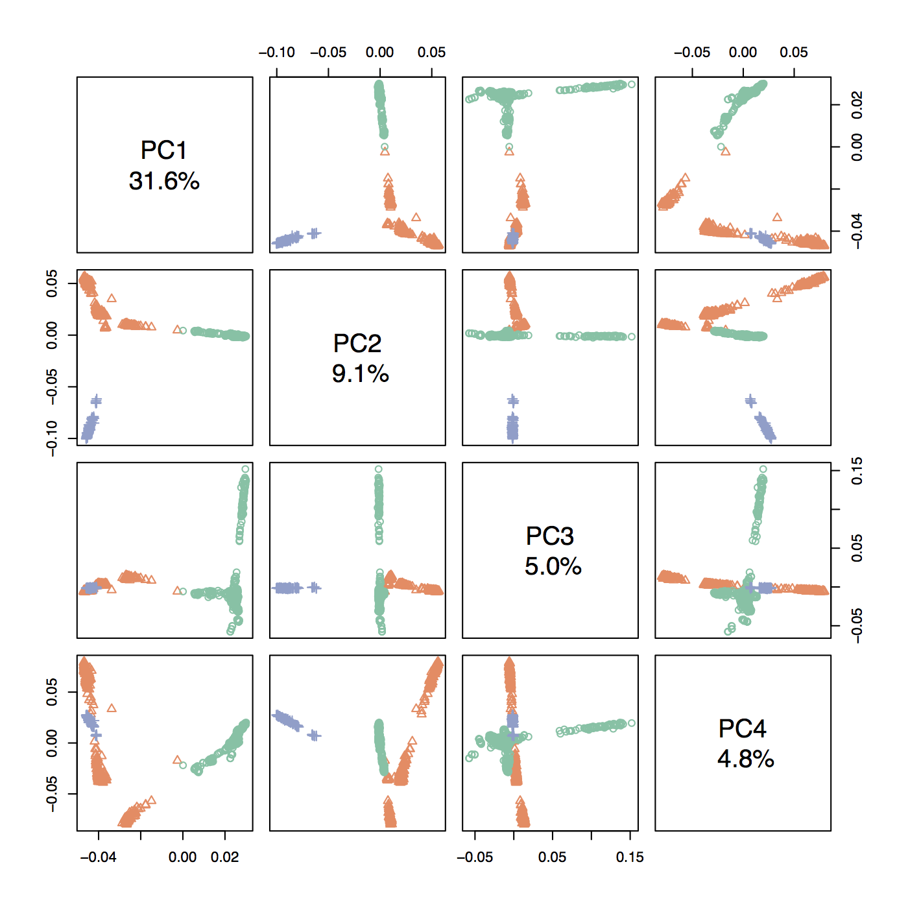

# Global ancestry of the merged dataset
The global ancestry analyses include a PCA, ADMIXTURE analysis, and three population test.  Prior to doing these analyses, I also built a "cluster" file that is needed, especially for plotting.  The format for this file is simply three columns: FID   IID   POP.  I assigned all samples to three possible 'pops', MexWolf, GrayWolf, and Dog.  
You can access this file here:
[Canine cluster file](./Data/canine.cluster)

## LD Prune dataset
Here we prune the 118287 SNP merged dataset for SNPs in high LD.  We use the R package (in bioconductor) [SNPRelate v0.9.18](http://bioconductor.org/packages/release/bioc/html/SNPRelate.html).  Pruning utilized a 1 MB window sliding window, and removing one from each pair of SNPs if the r > 0.5.

```R
# Load library
library(SNPRelate)

# Convet to gds file
bed.fn = "MERGED.clean.bed"
bim.fn = "MERGED.clean.bim"
fam.fn = "MERGED.clean.fam"
snpgdsBED2GDS(bed.fn, fam.fn, bim.fn, "MERGED.clean.gds")

# Open GDS file for pruning
genofile = openfn.gds("MERGED.clean.gds")


# Get sample IDs
samp.id <- read.gdsn(index.gdsn(genofile, "sample.id"))

# LD Prune 
snps2keep = snpgdsLDpruning(genofile, autosome.only = F, method = "r", slide.max.bp = 1000000, verbose = T, ld.threshold = 0.5, sample.id = samp.id)
   # 74876 SNPs are selected in total.

# Get a list of of the SNPs retained
snps.id = unlist(snps2keep)

# Save pruned dataset
snpgdsGDS2BED(genofile, bed.fn = "MERGED.clean.pruned", snp.id = snps.id)
```
After LD pruning, 74876 SNPs remained.  If repeated, this number does vary slightly due to stochasticity in the analysis. Also, SNPRelate alters the fam file output, so we overwrite it using the old fam file:

```bash
cp MERGED.clean.fam MERGED.clean.pruned.fam
```

## PCA Analysis
Here we construct a PCA for the Merged dataset again using SNPRelate.  The R code below continues from where we left off.

```R
# Make sure the library is loaded
library(SNPRelate)

# PCA (limited to the retained SNPs (not in LD)
pca = snpgdsPCA(genofile, autosome.only=  FALSE, snp.id = snps.id, sample.id = samp.id)
pc.percent <- 100 * pca$eigenval[1:32]/sum(pca$eigenval, na.rm = T)

# Plot Principle components (published in the article)
pdf("Merged-PCbars.pdf", width = 9, height = 7)
barplot(pc.percent[1:15], las = 1, ylab = "Percent Variation", xlab = "Principle Component", names.arg = c(1:15), ylim = c(0,35), axis.lty = 1)
dev.off()

# Read in the canine cluster file for plotting
pops = read.table("canine.cluster", header = F)

# Plot pairwise PCA for first 4 components, only save as a pdf if needed later
lbls <- paste("PC", 1:4, "\n", format(pc.percent[1:4], digits = 2), "%", sep = "")
palette(c("#66c2a5", "#fc8d62", "#8da0cb", "#e78ac3"))
pairs(pca$eigenvect[,1:4], col = as.factor(pops$V3), labels = lbls, pch = as.numeric(pops$V3))
dev.copy(pdf, "Merged-pairs-PCA.pdf", height = 4.5, width = 3.5)
   # Dog = green = circles
   # GrayWolf = orange =triangles
   # MexWolf = blue = crosses

# Make PCA Plot (published in the article)
pdf("MERGED.pca.pdf")
plot.new()
plot.window(xlim = c(min(pca$eigenvect[,1]), max(pca$eigenvect[,1])), ylim = c(min(pca$eigenvect[,2]), max(pca$eigenvect[,2])))
axis(1)
axis(2, las = 2)
box()
points(pca$eigenvect[,1], pca$eigenvect[,2], pch = as.numeric(pops$V3), col = as.factor(pops$V3))
title(xlab = "PC 1 - 31.6%", ylab = "PC 2 - 9.1%")
legend("topright", legend = c("Dog", "NAGW", "EUGW", "MW"), col = c(1, 2, "black", 3), pch = c(1, 2, 2, 3), bty = 'n')
dev.off()
```

The main PCA and barplot are published in the manuscript.  The paired PCA plot for the first 4 principle components can be found below:

    - Dog = green = circles
    - GrayWolf = orange = triangles
    - MexWolf = blue = crosses




## Admixture analysis
In this section we analysed the merged dataset using the program [ADMIXTURE v1.3](https://www.genetics.ucla.edu/software/admixture/).  The paper describing the software can be found in [Alexander et al. 2009 *Genome Research*](http://genome.cshlp.org/content/early/2009/07/31/gr.094052.109). Here are the general steps to run this analysis using the pruned dataset:

1.  Supervised Admixture Analysis
    - This analysis forces Mexican wolves to assign to either a Dog or Gray wolf population
    - Requires a '.pop' file (Assignments of known individuals.
2.  Unsupervised analysis
    - First, in R we generated 100 bootstrap replicates of the 88 Mexican wolves + 88 randomly sampled dogs + 88 randomly sampled gray wolves.
    - Then we ran Admixture for each dataset with *K* (number of populations) between 1 - 10.
    - Next, we determined the best values for *K* by finding the lowest cross validation (CV) error.
    - Ran admixture with *K* = 2... best estimate of *K*

```bash
# Make the .pop file for the supervised analysis in admixture
cut -f3 -d" " canine.cluster | \
   sed "s/MexWolf/-/g" > MERGED.clean.pruned.pop

# Run the supervised admxiture analysis with k=3
admixture \
   -j2 \
   --supervised \
   --cv=10 \
   -C 0.0001 \
   -c 0.0001 \
   MERGED.clean.pruned.bed \
   3
   ```
   
#### Next, in R we generated the 100 bootstrapped datasets.
   
```R
# Read in cluster file
cluster = read.table("canine.cluster", header = F, sep = " ")
fam = rep("0", 88)

# Run bootstrap loop process
for (i in 1:100){
   gw = subset(cluster, V3 == "GrayWolf")
   gw = gw[sample(1:nrow(gw), 88, replace = F), 1:2]
   gw = cbind(fam,paste(gw[,1],gw[,2],sep = "-"))
   mw = subset(cluster, V3 == "MexWolf")[,1:2]
   mw = cbind(fam,paste(mw[,1], mw[,2], sep = "-"))
   dog = subset(cluster, V3 == "Dog")
   dog = dog[sample(1:nrow(dog), 88, replace = F), 1:2]
   dog = cbind(fam, paste(dog[,1], dog[,2], sep = "-"))
   ind = rbind(gw, dog, mw)
   write.table(ind, file = paste("ind.", i, ".sample", sep = ""), quote = F, col.names = F, row.names = F, sep = "\t")
   print(paste0("Finished ", i))
}
```

#### Run each bootstrap replicate in ADMXITURE using a SLURM array job submission script

```bash
#!/bin/bash -l
# author: rfitak
#SBATCH -J admix.%a
#SBATCH -o admix.%a.out
#SBATCH -e admix.%a.err
#SBATCH -p serial
#SBATCH -n 1
#SBATCH --nodes=1
#SBATCH --cpus-per-task=1
#SBATCH -t 12:00:00
#SBATCH --mem-per-cpu=4000
#SBATCH --mail-type=END
#SBATCH --mail-user=rfitak9@gmail.com
#SBATCH --array=1-100

# Change to working directory
cd ADMIXTURE

# Make a bed|bim|fam file for each bootstrap
plink \
   --noweb \
   --dog \
   --nonfounders \
   --bfile MERGED.clean.pruned \
   --keep ind.${SLURM_ARRAY_TASK_ID}.sample \
   --make-bed \
   --out admix-input.${SLURM_ARRAY_TASK_ID}

# Remove unnecessary files
rm -rf admix-input.${SLURM_ARRAY_TASK_ID}.{log,nosex}

# Run ADMIXTURE for K = 1-10
for i in {1..10}
do
admixture \
   -j1 \
   --cv=10 \
   -C 0.0001 \
   -c 0.0001 \
   admix-input.${SLURM_ARRAY_TASK_ID}.bed \
   $i | \
   tee log${SLURM_ARRAY_TASK_ID}.k${i}.out
done
```

#### Get a file of CV error for each K in each file

```bash
for k in {1..10}
do
   for i in {1..100}
   do
      a=$(grep CV log${i}.k${k}.out | cut -d" " -f4)
      echo "$k $i $a" >> CV.tbl
   done
done
```

# Plot CV error in R
```R
# Load library for error bars
library(Hmisc)

# Load CV error data file
a = read.table("CV.tbl", sep = " ", header = F)

# Begin plot
plot.new()
plot.window(xlim = c(1, 10), ylim = c(min(a$V3), max(a$V3)))
axis(1)
axis(2,las = 1)
box()
title(xlab = "K", ylab = "CV error")
for (i in 1:100){
   y = subset(a, V2 == i)
   points(y$V1, y$V3, type = "l", col = "gray", lwd = 0.5)
}
for (i in 1:10){ # Plot error bars
   y = subset(a, V1 == i)$V3
   ul = mean(y) + sd(y)
   ll = mean(y) - sd(y)
   #points(i, mean(y), pch = 19)
   errbar(i, mean(y), ul, ll, pch = 1, cex = 1.5, col = "black", add = T)
}
```

## 3 Population test
Here we perform the three population test as implemented in [TREEMIX v1.12](https://code.google.com/archive/p/treemix/).  TREEMIX was published in [Pickrell et al. 2012 *PLoS Genetics*](https://doi.org/10.1371/journal.pgen.1002967).  The actual 3 population test, or F3 test, is described in two papers:
1.  [Reich et al. 2009 *Nature*](https://www.nature.com/articles/nature08365)
2.  [Patterson et al. 2012 *Genetics*](https://doi.org/10.1534/genetics.112.145037)
    - "The 3-population test, is a formal test of admixture and can provide clear evidence of admixture, even if the gene flow events occurred hundreds of generations ago. If we want to test if C has ancestry from populations related to A and B then we can perform the test f3(C; A, B). If C is unadmixed, then f3 (C ; A, B) has non-negative mean. If f3 (C ; A, B) has negative mean, in contrast, this implies that C is admixed with populations close to A and B (check the significance of the f3 mean and Z-score).

We first made a new cluster file that groups samples into more specific populations based on breed and captive population of Mexican Wolf (MB, GR, AG, or CL).  The new cluster file is available here:
[canine cluster file 2](./Data/canine-cluster2.txt)

```bash
# Get allele frequencies by population (from cluster file)
plink \
   --noweb \
   --dog \
   --nonfounders \
   --bfile MERGED.clean.pruned \
   --freq \
   --within canine-cluster2.txt \
   --out MERGED.clean.pruned.treemix

# Compress the 'stratified' allele frequency file
gzip MERGED.clean.pruned.treemix.frq.strat

# Convert to a treemix input file using the python script included with TREEMIX
plink2treemix.py MERGED.clean.pruned.treemix.frq.strat.gz treemix-input.gz

# Run TREEMIX
threepop \
   -i treemix-input.gz \
   -k 100 > threepop.k100.output

# Remove unnecessary lines from output
grep -v "^Estim" threepop.k100.output | \
   grep -v "^total" | \
   grep -v "^npop" > tmp
sed -i -e "s/ /\t/g" \
   -e "s/;/\t/g" \
   -e "s/,/\t/g" tmp
mv tmp threepop.k100.tbl
```

#### Process and plot 3 population test output in R
```R
# Load 3 population test scores
a = read.table("threepop.k100.tbl", sep = "\t", header = F)

# Subset by groups/pops
mb = subset(a, V1 == "MB")
gr = subset(a, V1 == "GR")
ar = subset(a, V1 == "AR")
x = subset(a, V1 == "X")
EUGW = c("EURO","WO_LUPA")
NAGW = c("MB","GR","AR","X","WO_BC","WO_INTAK","WO_WO","WO_MN","WO_ID","WO_SEAK","WO_MAT")
wolves = c("EURO","MB","GR","AR","X","WO_LUPA","WO_BC","WO_INTAK","WO_WO","WO_MN","WO_ID","WO_SEAK","WO_MAT")
dogs = c("MIXED","PDL","BET","BGL","BMD","BOC","BOT","BRS","COS","DAC","DOB","EBD","ELK","EST","EUR","FSP","GOS","GRE","GRY","GSH","GSL","HUS","IRW","JRT","LRE","NFD","NSD","RTW","SCI","SHP","STP","TYO","WEI")

# Separate by parental population pairs (ww = wolf x wolf, dog = dog x dog, dw = dog x wolf | wolf x dog)
mb.ww = mb[mb$V2 %in% wolves & mb$V3 %in% wolves,]
mb.dog = mb[mb$V2 %in% dogs & mb$V3 %in% dogs,]
mb.dw1 = rbind(mb[mb$V2 %in% dogs & mb$V3 %in% EUGW,], mb[mb$V2 %in% EUGW & mb$V3 %in% dogs,])
mb.dw2 = rbind(mb[mb$V2 %in% dogs & mb$V3 %in% NAGW,], mb[mb$V2 %in% NAGW & mb$V3 %in% dogs,])

ar.ww = ar[ar$V2 %in% wolves & ar$V3 %in% wolves,]
ar.dog = ar[ar$V2 %in% dogs & ar$V3 %in% dogs,]
ar.dw1 = rbind(ar[ar$V2 %in% dogs & ar$V3 %in% EUGW,], ar[ar$V2 %in% EUGW & ar$V3 %in% dogs,])
ar.dw2 = rbind(ar[ar$V2 %in% dogs & ar$V3 %in% NAGW,], ar[ar$V2 %in% NAGW & ar$V3 %in% dogs,])

gr.ww = gr[gr$V2 %in% wolves & gr$V3 %in% wolves,]
gr.dog = gr[gr$V2 %in% dogs & gr$V3 %in% dogs,]
gr.dw1 = rbind(gr[gr$V2 %in% dogs & gr$V3 %in% EUGW,], gr[gr$V2 %in% EUGW & gr$V3 %in% dogs,])
gr.dw2 = rbind(gr[gr$V2 %in% dogs & gr$V3 %in% NAGW,], gr[gr$V2 %in% NAGW & gr$V3 %in% dogs,])

x.ww = x[x$V2 %in% wolves & x$V3 %in% wolves,]
x.dog = x[x$V2 %in% dogs & x$V3 %in% dogs,]
x.dw1 = rbind(x[x$V2 %in% dogs & x$V3 %in% EUGW,], x[x$V2 %in% EUGW & x$V3 %in% dogs,])
x.dw2 = rbind(x[x$V2 %in% dogs & x$V3 %in% NAGW,], x[x$V2 %in% NAGW & x$V3 %in% dogs,])

# Build bars for barplot
bars = list(mb.ww$V6, mb.dog$V6, mb.dw1$V6, mb.dw2$V6, ar.ww$V6, ar.dog$V6, ar.dw1$V6, ar.dw2$V6, gr.ww$V6, gr.dog$V6, gr.dw1$V6, gr.dw2$V6, x.ww$V6,x.dog$V6, x.dw1$V6, x.dw1$V6)

# Reorder bars
bars = bars[c(3, 7, 11, 4, 8, 12, 2, 6, 10, 1, 5, 9, 13)]

# Setup colors
colors = c("#3771c8", "#d40000", "green", "darkgray")
colors = rev(colors[c(1, 2, 3, 1, 2, 3, 1, 2, 3, 1, 2, 3, 4)])

# Build plot
plot.new()
plot.window(xlim = c(-42, 181), ylim = c(1,13))
boxplot(rev(bars), horizontal = T, col = colors, add = T, border = T)
abline(v = 0, lwd = 2, lty = "dashed", col = "black")
abline(h = c(4.5, 7.5, 10.5), lwd = 1, lty = 1, col = "black")
legend("topright", legend = c("MB", "AG", "GR", "CL"), col = rev(colors), pch = 15)
title(xlab = "Z-score", ylab = "Population")
dev.copy(pdf, "zscores.pdf")
dev.off()
```
