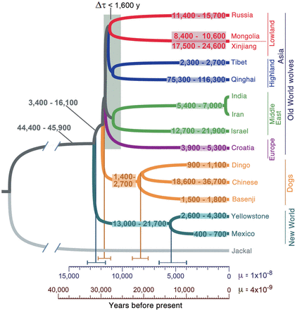

# Simulating Canine Evolutionary History
This set of code contains the scripts for simulating the demographic history of Mexican wolves, North American gray wolves, European gray wolves, and domestic dogs.  The demographic model used is that from [Fan et al. (2016, doi:10.1101/gr.197517.115)](http://genome.cshlp.org/content/26/2/163). Below is Figure 6 from Fan et al. (2016):  
  
Caption: Demographic model inferred using G-PhoCS. Estimates of divergence times and effective population sizes (Ne) inferred by applying a Bayesian demography inference method (G-PhoCS) to sequence data from 13,647 putative neutral loci in a subset of 22 canid genomes (because of limitations in computational power). Estimates were obtained in four separate analyses (Methods; Supplemental Table 6). Ranges of Ne are shown and correspond to 95% Bayesian credible intervals. Estimates are calibrated by assuming a per-generation mutation rate of μ = 10−8. Mean estimates (vertical lines) and ranges corresponding to 95% Bayesian credible intervals are provided at select nodes. Scales are given in units of years by assuming an average generation time of 3 yr and two different mutation rates: μ = 10−8 (dark blue) and μ = 4 × 10−9 (brown). The model also considered gene flow between different population groups (see Table 1).

After limiting this to just the four groups of interest, the tree looks like this:  
((MW),(NA_GW)),((EU_GW),(DOGS))  
- MW = Mexican wolves  
- NA_GW = North American gray wolves  
- EU_GW = European gray wolves  
- DOGS = domestic dogs

The divergence times are thus (years before present with confidence intervals):
- MW vs NA_GW: 5400 (4000 - 6600)
- EU_GW vs DOGS: 11700 (11100 - 12300)
- (MW + NA_GW) vs (EU_GW + DOGS): 12500

And ancestral population sizes are (mean and confidence interval):
- Ancestral: 45,100 (44,900 - 45,900)
- MW + NA_GW: 17,300 (13,000 - 21,700)
- MW: 600 (400-700)
- NA_GW: 3,500 (2,600 - 4,300)
- EU_GW + DOG: 8,000 (3,400 - 16,100)
- EU_GW: 3,900 - 5,300
- DOG: 1,400 - 2,700

## Step 1:  Simulate SNP data using MACS
In this step we will simulate SNP data for Mexican wolves with various levels of migration. For each of the 38 autosomes, we will sample 176 MW, 460 NA_GW, 138 EU_GW, and 1268 DOGS chromosomes for the final output.  These sample sizes match exactly those reported in our study.  The lengths of each chromosome were retrieved from the [dog genome browser at NCBI](https://www.ncbi.nlm.nih.gov/genome?term=canis%20lupus%20familiaris).  The recombination rates for each chromosome were from the dog linkage map reported in [Wong et al. (2010, doi:10.1534/genetics.109.106831)](https://www.ncbi.nlm.nih.gov/pmc/articles/PMC2828735/).  Both the lengths and recombination rates for each chromosome are listed in the "chromosomes.txt" file as columns 1 and 3, respectively, inside the data folder.  
All population sizes are scaled relative to Ne=10000.  
All times are scales to 4Ne generations, with a generation tme of 3 years (Fan et al. 2016).  
The mutation rate is set to 1x10^-8 changes/site/generation (Fan et al. 2016).  
The simulation program [MACS](https://github.com/gchen98/macs) was used, and includes both the executables *macs* and *msformatter*.
As for migration, we employed a total of 12 possible scenarios.  These migration schemes varied in the migration rate (m) from domestic dogs into mexican wolves, when migration occurred (t), and for how long (ngen).  See the table below:

| m | t | ngen | MACS1 | MACS2 |
| --- | --- | --- | --- | --- |
| 0.05 | 2 | 1 | -em 0.00005 1 4 2000 | -em 0.000075 1 4 0 |
| 0.05 | 20 | 1 | -em 0.0005 1 4 2000 | -em 0.000525 1 4 0 |
| 0.05 | 200 | 1 | -em 0.005 1 4 2000 | -em 0.005025 1 4 0 |
| 0.05 | 2 | 5 | -em 0.00005 1 4 2000 | -em 0.000175 1 4 0 |
| 0.05 | 20 | 5 | -em 0.0005 1 4 2000 | -em 0.000625 1 4 0 |
| 0.05 | 200 | 5 | -em 0.005 1 4 2000 | -em 0.005125 1 4 0 |
| 0.15 | 2 | 1 | -em 0.00005 1 4 6000 | -em 0.000075 1 4 0 |
| 0.15 | 20 | 1 | -em 0.0005 1 4 6000 | -em 0.000525 1 4 0 |
| 0.15 | 200 | 1 | -em 0.005 1 4 6000 | -em 0.005025 1 4 0 |
| 0.15 | 2 | 5 | -em 0.00005 1 4 6000 | -em 0.000175 1 4 0 |
| 0.15 | 20 | 5 | -em 0.0005 1 4 6000 | -em 0.000625 1 4 0 |
| 0.15 | 200 | 5 | -em 0.005 1 4 6000 | -em 0.005125 1 4 0 |

The last two columns are the MACS parameters to set the migration rate (m \* 4 \* No) at time t (t/4\*No) and to remove the migration after ngen (t+ngen/4\*No)

Below is the simulation code for just the first migration scheme (see row 1 above).  The files [chromosomes.txt](./Data/chromosomes.txt), [ascertainment.txt](./Data/ascertainment.txt) and the script [process-macs.R](./Data/process-macs.R) is available in the [Data](./Data) folder.

```bash
# Make a folder of simulations
mkdir SIMS
cd SIMS

# Copy over some needed files
cp ../ascertainment.txt .
cp ../process-macs.R .
cp ../chromosomes.txt .

# Start a loop for each chromosome
for c in {1..38}; do

   # Make a folder for the chromosome
   mkdir CHR${c}
   cd CHR${c}
   
   # Copy over files again
   cp ../ascertainment.txt .
   cp ../process-macs.R .

   # Get the length and recombination rate for each chromsome (scale recombination rate by 4*Ne)
   len=$(sed -n "$c"p ../chromosomes.txt | cut -d" " -f1)
   rec=$(sed -n "$chr"p ../chromosomes.txt | cut -d" " -f3)
   rec=$(awk "BEGIN {print "${rec}"*40000}")
   
   # Start a loop for each replicate simulation
   for i in {1..10}; do
   
      # Run the simulations
      macs 2042 $len \
         -i 1 \
         -t 0.0004 \
         -r $rec \
         -I 4 176 460 138 1268 0 \
         -n 1 0.06 \
         -n 2 0.35 \
         -n 3 0.46 \
         -n 4 0.205 \
         -em 0.00005 1 4 2000 \
         -em 0.000075 1 4 0 \
         -ej 0.045 1 2 \
         -en 0.045025 2 1.73 \
         -ej 0.0975 3 4 \
         -en 0.097525 4 0.8 \
         -ej 0.104167 2 4 \
         -en 0.104175 4 4.51 \
         -F ascertainment.txt 1 \
         2> errors | \
         msformatter > chr${c}_${i}.macs
         
         # Clean up unused output files to save disk space
         rm -rf errors haplo* tree*
         
   # Close loop of replicates
   done
   
   # Move up a folder
   cd ..
   
# Close loop of chromosomes
done
```
Description of parameters used:
- -i 1 :: the number fo replicates
- -t 0.0004 :: theta, 4*Ne*u
- -r $rec :: recombination rate
- -I 4 176 460 138 1268 0 :: <# populations> <chromosomes per population> <migration rate>
- -n 1 0.06 :: population size, <pop ID> <scaled size>
- -ej 0.045 1 2:: at time 0.045 (scaled generations), merge populations 1 and 2
- -en 0.045025 2 1.73 :: at time 0.045025 (scaled generations), change the Ne of population 2 to 1.73 (scaled by Ne=10000)
- -F ascertainment.txt 1 :: simple text file containing "0.05 0". This means to exlude SNPs with MAF < 0.05

## Step 2: Parse the simulation output
This step reformats the output haplotypes (chromosomes) into a genotype matrix.  Then, an R script is used to remove any SNP deviating from Hard-Weinberg equilibrium (p < 0.001) following the method by [Wigginton et al. (2005, doi:10.1086/429864)](https://www.ncbi.nlm.nih.gov/pmc/articles/PMC1199378/).  Afterwards, the SNP genotypes are thinned to correspond with the number of SNPs in the observed dataset (see the file "chromosomes.txt" inthe "Data" folder).  Finally, the genotype matrix is converted to the PLINK 'tped' format.  The chromosome lengths are retrieved as described above, as well as the desired number of SNPs (second column of "chromosomes.txt" file).
```bash
# Make sure to be in the SIMS folder
cd SIMS

# Start a loop for each chromosome
for c in {1..38}; do
   
   # Move into the chromosome folder
   cd CHR${c}

   # Get the length for each chromsome and the number of SNPs needed
   len=$(sed -n "$c"p ../chromosomes.txt | cut -d" " -f1)
   nsnps=$(sed -n "$c"p ../chromosomes.txt | cut -d" " -f2)
   
   # Start a loop for each of the 10 replicates
   for i in {1..10}; do
   
      # Make a list of every SNP position
      sed -n '6p' chr${c}_${i}.macs | \
         tr " " "\n" | \
         sed '1d' > chr${c}_${i}.pos
     
      # Convert into a genotype matrix
      tail -n +7 chr${c}_${i}.macs | \
         sed 's/\(.\)/\1 /g' | \
         sed "s/ $//g" > chr${c}_${i}.geno
        
      # Remove SNPs out of HWE (p<0.001), thin, reformat to tped
      Rscript \
         process-macs.R \
         chr${c}_${i}.geno \
         chr${c}_${i}.pos \
         $c \
         $len \
         $nsnps \
         $i
     
      # Remove all the unnecessary files to save disk space
      rm -rf chr${c}_${i}.geno chr${c}_${i}.pos chr${c}_${i}.macs
      
      # Change all alleles: 1=A, 2=G
      cut -f5- chr${c}_${i}.tped | sed -e "s/1/A/g" -e "s/2/G/g" | paste -d" " <(cut -d" " -f1-4 chr${c}_${i}.tped) - > chr${c}_${i}.tped2
      mv -f chr${c}_${i}.tped2 chr${c}_${i}.tped

   # Close loop of replicates
   done
   
   # Move up a folder
   cd ..
   
# Close loop of chromosomes
done
```
Below is the R script "process-macs.R".  It is also available in the [Data](./Data) folder of this github repository.  The R package "data.table" is required.
```R
# Make sure to be in R.  I used version 3.3.2 (2016-10-31) -- "Sincere Pumpkin Patch"
# Process in R
# args = genofile, posfile, chr_number, chr_length, nsnps, iteration
# e.g., args=c("genos.mat", "pos.txt", "1", "1.23e8", "6219", "1")
args = commandArgs(trailingOnly=TRUE)
library(data.table)

# Load data
data = fread(args[1])
pos = scan(args[2])

################################
################################
################################
# This code implements an exact SNP test of Hardy-Weinberg Equilibrium as described in
# Wigginton, JE, Cutler, DJ, and Abecasis, GR (2005) A Note on Exact Tests of 
# Hardy-Weinberg Equilibrium. American Journal of Human Genetics. 76: 000 - 000  

# NOTE: return code of -1.0 signals an error condition

SNPHWE <- function(obs_hets, obs_hom1, obs_hom2){
   if (obs_hom1 < 0 || obs_hom2 < 0 || obs_hets < 0)
      return(-1.0)

   # total number of genotypes
   N <- obs_hom1 + obs_hom2 + obs_hets
   
   # rare homozygotes, common homozygotes
   obs_homr <- min(obs_hom1, obs_hom2)
   obs_homc <- max(obs_hom1, obs_hom2)

   # number of rare allele copies
   rare  <- obs_homr * 2 + obs_hets

   # Initialize probability array
   probs <- rep(0, 1 + rare)

   # Find midpoint of the distribution
   mid <- floor(rare * ( 2 * N - rare) / (2 * N))
   if ( (mid %% 2) != (rare %% 2) ) mid <- mid + 1

   probs[mid + 1] <- 1.0
   mysum <- 1.0

   # Calculate probablities from midpoint down 
   curr_hets <- mid
   curr_homr <- (rare - mid) / 2
   curr_homc <- N - curr_hets - curr_homr

   while ( curr_hets >=  2)
      {
      probs[curr_hets - 1]  <- probs[curr_hets + 1] * curr_hets * (curr_hets - 1.0) / (4.0 * (curr_homr + 1.0)  * (curr_homc + 1.0))
      mysum <- mysum + probs[curr_hets - 1]

      # 2 fewer heterozygotes -> add 1 rare homozygote, 1 common homozygote
      curr_hets <- curr_hets - 2
      curr_homr <- curr_homr + 1
      curr_homc <- curr_homc + 1
      }    

   # Calculate probabilities from midpoint up
   curr_hets <- mid
   curr_homr <- (rare - mid) / 2
   curr_homc <- N - curr_hets - curr_homr
   
   while ( curr_hets <= rare - 2)
      {
      probs[curr_hets + 3] <- probs[curr_hets + 1] * 4.0 * curr_homr * curr_homc / ((curr_hets + 2.0) * (curr_hets + 1.0))
      mysum <- mysum + probs[curr_hets + 3]
         
      # add 2 heterozygotes -> subtract 1 rare homozygtote, 1 common homozygote
      curr_hets <- curr_hets + 2
      curr_homr <- curr_homr - 1
      curr_homc <- curr_homc - 1
      }    
 
    # P-value calculation
    target <- probs[obs_hets + 1]

    #plo <- min(1.0, sum(probs[1:obs_hets + 1]) / mysum)

    #phi <- min(1.0, sum(probs[obs_hets + 1: rare + 1]) / mysum)

    # This assignment is the last statement in the fuction to ensure 
    # that it is used as the return value
    p <- min(1.0, sum(probs[probs <= target])/ mysum)
    }

################################
################################
################################

# Calc HWE for each column
HWE.Wigginton = function(x){
   A1 = x[seq(1, length(x), 2)]
   A2 = x[seq(2, length(x), 2)]
   geno = paste0(A1, A2)
   HOM1 = length(geno[geno == "00"])
   HOM2 = length(geno[geno == "11"])
   HET = length(geno[geno == "10" | geno == "01"])
   p = SNPHWE(HET, HOM1, HOM2)
   return(p)
}

hwe = apply(data, 2, HWE.Wigginton)
keep = which(hwe > 0.001)
print(paste0("A total of ",
   ncol(data) - length(keep),
   " SNPs were removed (HWE p-value < 0.001) and ",
   length(keep),
   " remain."))

# Make new datatable
data.hwe = data[, keep, with = FALSE]
pos.hwe = paste0("chr", as.numeric(args[3]), "_", round(as.numeric(args[4]) * pos[keep]))

# Thin to the given number of snps
thin = seq(1, length(pos.hwe), round(length(pos.hwe) / as.numeric(args[5])))
data.hwe.thin = data.hwe[, thin, with = FALSE]
data.hwe.thin[data.hwe.thin == 0] <- 2
pos.hwe.thin = pos.hwe[thin]

# Convert to tped
tped = cbind(rep(as.numeric(args[3]),
   length(pos.hwe.thin)),
   pos.hwe.thin,
   rep(0, length(pos.hwe.thin)),
   as.numeric(sub(paste0("chr", as.numeric(args[3]), "_"), "", pos.hwe.thin)),
   t(data.hwe.thin))
write.table(tped, file = paste0("chr", as.numeric(args[3]), "_", as.numeric(args[6]), ".tped"), quote = F, row.names = F, col.names = F, sep = " ")
```
At the completion of this step, there should be 10 tped files in a folder for each chromosome.  Each tped file is a different replicate.

## Step 3: Prepare input files for LAMP-LD
This section now parses the tped files to produce files that can be read by [LAIT](http://www.pitt.edu/~wec47/lait.html) and thus converted to the input files for use by LAMP-LD.
```bash
# Make sure to be in the SIMS folder
cd SIMS

# Start a loop for each chromosome
for c in {1..38}; do
   
   # Move into the chromosome folder
   cd CHR${c}

   # Loop through each replicate
   for i in {1..10}; do
   
      # Get the MW genotypes in tped format
      cut -f1-180 -d" " chr${c}_${i}.tped > MW_${i}.tped
      
      # Make a general tfam file
      for z in {1..88}; do echo "MW $z 0 0 0 0" >> MW_${i}.tfam; done
      
      # Convert MW tped into ped format and remove unneeded files
      plink \
         --noweb \
         --nonfounders \
         --dog \
         --tfile MW_${i} \
         --recode \
         --out MW_${i}
      rm -rf MW_${i}.nosex MW_${i}.log MW_${i}.tfam MW_${i}.tped MW_${i}.map
      
      # Transpose the genoype matrix
      transpose --fsep " " -t --limit 10000x10000 chr${c}_${i}.tped | tail -n +5 | sed "s/ //g" > tmp
      
      # Get the gray wolf (GW) and DOG haplotypes
      head -774 tmp | tail -n 598 > chr${c}_${i}_gw.hap
      tail -n 1268 tmp > chr${c}_${i}_dog.hap
      
      # Get the map file (first 4 columns of tped format) and list of SNPs
      cut -f1-4 -d" " chr${c}_${i}.tped > chr${c}_${i}.map
      cut -f2 -d" " chr${c}_${i}.tped > chr${c}_${i}.snps
      
      # Remove unneeded files
      rm -rf tmp
      
      # Run lait.pl to build files for LAMP-LD
      mkdir LAMPLD_${i}
      lait.pl \
         lampld 2 \
         chr${c}_${i}.map \
         MW_${i}.ped \
         chr${c}_${i}.snps \
         chr${c}_${i}_gw.hap \
         chr${c}_${i}_dog.hap \
         LAMPLD_${i}
      
   # End the replicate loop
   done
   
   # Move up a folder
   cd ..

# Close the loop for each chromosome
done
```
The program 'transpose' is a new coreutil for Unix that needs to be installed.  It can be installed like so:
```bash
# Download transpose
wget https://sourceforge.net/projects/transpose/files/transpose/transpose-2.0/2.0/transpose-2.0.zip

# Unpack and build it
unzip transpose-2.0.zip
cd transpose-2.0/src
gcc transpose.c -o transpose

# Move into a folder in the PATH
mv transpose /wrk/rfitak/SOFTWARE/EXECUTABLES/

# Remove folder
cd ../..
rm -rf transpose*
```

## Step 4: Run LAMPLD
```bash
# Path to program files
bin=/wrk/rfitak/LAIT/bin

# Start from SIMS folder
cd SIMS

# Start a loop for each chromosome
for c in {1..38}; do
   
   # Move into the chromosome folder
   cd CHR${c}

   # Loop through each replicate
   for i in {1..10}; do
      cd LAMPLD_${i}
      $bin/unolanc2way \
         100 \
         50 \
         chr.pos \
         pop1.hap \
         pop2.hap \
         genofile.gen \
         chr${c}_lampld.out
      $bin/convertLAMPLDout.pl chr${c}_lampld.out chr${c}_lampld.converted.out
      $bin/standardizeOutput.pl lampld 2 chr${c}_lampld.converted.out chr${c}_ancestry.standardized.txt
      $bin/averageAncestry.pl phased 2 chr${c}_ancestry.standardized.txt chr${c}_avg.ancestry.txt  
   
      # Move up a folder
      cd ..
   
   # Close replicate loop
   done

   # Move up a folder
   cd ..

# Close the loop for each chromosome
done
 ```

Wow!  That is quite a set of code for the simulations!  To streamline the process, it has all been concatenated into a single job script for SLURM.  The job runs as an array for each chromosome (separate job for each chromosome).  A separate script was submitted for each migration scheme, and the script for the first scheme, [sims.sh](./Data/sims.sh), is available in the [Data](./Data) folder.

## Step 4: Convert the LAM-LD output to bed format
Next we must identify the different segments, or ancestry "tracts" and put them in a bed format.  The bed format is basically a tab-delimited text file, where the first three columns are "chromosome", "start position", and "end position".  The remaining columns can contain any other information and are not generally processed.

The code below makes a bed file, `out.bed` for a set of simulations above.  The code for just one of the migration schemes is shown.  There are 38 chromosomes, 10 replicates, and 88 individuals per replicate.  Therefore, in total there are 880 individual Mexican wolves per migration scheme.
```bash
# Make sure you are again the correct folder
cd SIMS

# Make bed file
for c in {1..38}
do
   for r in {1..10}
   do
      for i in {1..88}
      do
      haps=$(sed -n "$i"p CHR${c}/LAMPLD_${r}/chr${c}_lampld.out | sed "s/^ //" | tr " " "\n")
      nsegs=$(echo "$haps" | wc -l)
      if [ "$nsegs" == "1" ]
         then
         snpend=$(echo "$haps" | cut -d":" -f2)
         geno=$(echo "$haps" | cut -d":" -f1)
         stop=$(sed -n "$snpend"p CHR${c}/LAMPLD_${r}/chr.pos)
         echo -ne "${c}\t0\t${stop}\tInd_${r}-${i}\t${geno}\n" >> out.bed
      else
         start=0
         for hap in `echo "$haps"`
            do
            snp=$(echo -n "$hap" | cut -d":" -f2)
            stop=$(sed -n "$snp"p CHR${c}/LAMPLD_${r}/chr.pos)
            geno=$(echo -n "$hap" | cut -d":" -f1)
            echo -ne "${c}\t${start}\t${stop}\tInd_${r}-${i}\t${geno}\n" >> out.bed
            start=$(( $stop + 1 ))
         done
      fi
      echo "Finished chr $c replicate $r ind $i"
      done
   done
done
```


## Step 5: Visualize the Output

